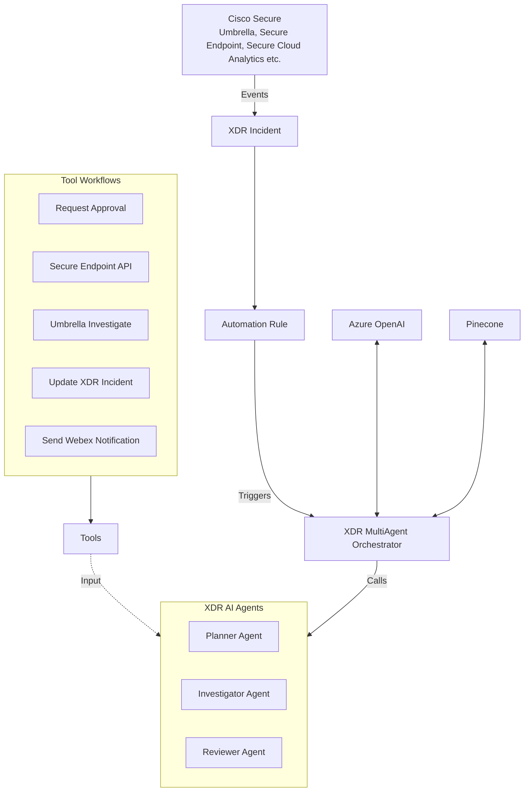

## BRKOPS-1557: Automating Detection & Response Outcomes using Cisco XDR & Generative AI

[About Cisco Live](https://www.ciscolive.com/global.html) | [**Link to Session Presentation**](/BRKOPS-1557.pdf) | [**Link to Session Recording**](https://www.ciscolive.com/on-demand/on-demand-library.html?search=scott%20dozier&zid=emea&search.event=1737762187215001jsy4&search=scott+dozier#/video/1740702270936001hcHJ)

### Session Demo Objective

> [!NOTE]
> At Cisco Live 2023, we demonstrated how you could author an incident response workflow in the XDR Automate GUI and automatically trigger it with the detection & subsequent creation of an incident in XDR, leveraging Automation Rules. We used a Command & Control attack as an example to present investigation with Cisco Umbrella & remediation with Cisco Secure Endpoint. See 2023's [session repository](https://github.com/ciscomanagedservices/ciscolive23-xdr-automate) for more details. 
>
> We refer to these workflows as being _**rules-based**_ because they only work for the use-cases that they are authored for and follow a pre-defined, prescriptive sequence of activities.
>
> At Cisco Live 2024, we introduced a framework built with XDR Automate that enables **AI-driven response workflows**, powered by a Large Language Model and equipped with specialized tools, that can triage a large variety of incident types without pre-defined, prescriptive sequencing of activities. 

At Cisco Live 2025, we have expanded the 2024 framework built with XDR Automate to utilize multiple agents.  The AI Agent workflow can be utilized by itself to accomplish nearly any task.  We demonstrate how a `Incident Agent Orchestrator` workflow can assign tasks to different agents to further improve our incident response.

This framework will allow you to:

1. Benefit from the vast, inherent knowledge AI Large Language Models have of how to respond to security events, readily applied to XDR Incidents
2. Bring or create your own XDR Automate 'tool' workflows to teach or empower AI to interface with a product or capability, perform analysis or collaborate with other AI agents & tools
3. Control AI's behavior or change functionality using natural language in plain text (_seriously, how much simpler could it get?_).  You can inject a set of customer instructions store in Pinecone or other source of your choosing.

### Our Framework

The visualization below represents how the framework comes together:

#### In this repository, you'll find the following workflows:

1. [XDR MultiAgent Orchestrator](/XDR-IncidentOrchestrator__definition_workflow_02JIZAQB57V1J3ZjuoFo7ulzhuoHTX25Xz7/): Parent workflow that brings it all together. This workflow _accepts_ XDR Incidents and calls other agents  at it's disposal in an attempt to diagnose, investigate and remediate the incident. 
   1. [XDR AI Agent](/XDRAIAgent__definition_workflow_02JGIZBHJ2P3N7ar9Au4l6VY1Ga8CJckfnI/): The base intelligent agent work flow. This workflow takes inputs of role, description, task, output format, and tool categories. Uses available tools (workflows) to accomplish task.
      1. **[Subworkflow]** Convert Workflows to OpenAI Tools: This workflow _automagically_ converts your XDR Automate workflows into 'tools' that the XDR Incident Agent can use.
2. Tool Workflows (we provide the following as examples):
    1. [Tool - Request Change Approval](/Tool-RequestChangeApproval__definition_workflow_02DIUZE85QAXE1Xes1tBKwjNjfz1ewzyOwN/): creates an approval task in XDR for human intervention.
    2. [Tool - Secure Endpoint API](/Tool-SecureEndpointAPI__definition_workflow_02DERU2M6K93C00tAcfL9vATtUNqezRLtQK/): a _web service client_ to interact with the Secure Endpoint API.
    3. [Tool - Umbrella Investigate API](/Tool-UmbrellaInvestigateAPI__definition_workflow_02DEPRI15KGL573NNQVZzBs5v9RM8zlwTjp/): a _web service client_ to interact with the Umbrella Investigate API.
    4. [Tool - Update XDR Incident](/Tool-Update-XDR-Incident__definition_workflow_02JJ7894W37GW2scLuUW223Hotg4zUed8RO/): creates a worklog entry/note on an XDR incident.
    5. [Tool - Send Webex Notification](/Tool-SendWebexNotification__definition_workflow_02DEI6Q3YN17F2HQzFzsoqPshYqm2fAcZgK/): sends a message to a Webex space.

### Guidance on building tool workflows

1. Descriptions: Your workflow, input & output variables **must** have descriptions. This is how the XDR Incident Agent interprets what each tool does, which directly influences what tool it selects to perform the task it needs to perform.
2. Outputs: For consistency, have an output variable (like `o_message_content` in the example tools) per tool workflow, that you populate with the successful execution output (like the response payload for a tool that makes an API request) or with the error message in the event your tool workflow fails.
3. Categorize: Put all your tool workflows into a category. You will then supply the name of this category as input to the [Convert Workflows to OpenAI Tools]() workflow; this is how it knows how to find your tools.

 

---

Please note that workflow content in this repository will not be kept up to date with new code releases/patches. If you're a Cisco Live attendee, you may create an issue on this repository or reach out to us via email for queries and/or feedback.

Oh and, while you're here, you may want to check out [some of our other content](https://github.com/ciscomanagedservices) as well 🚀 

Contributors:

1. Aman Sardana (amasarda@cisco.com)
2. Scott Dozier (scdozier@cisco.com)
3. Steve Holl (sholl@cisco.com)

Cisco CX, 2025
